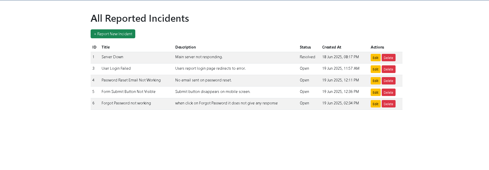
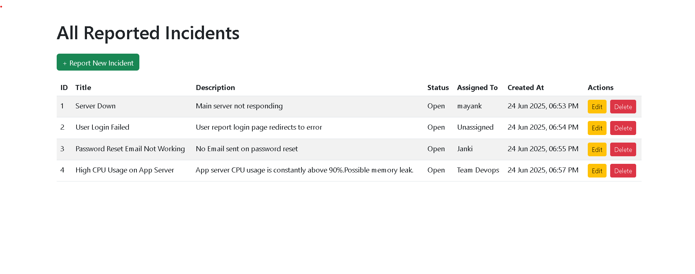
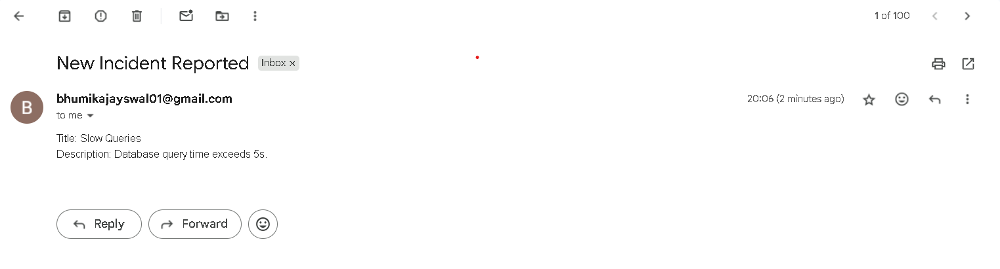
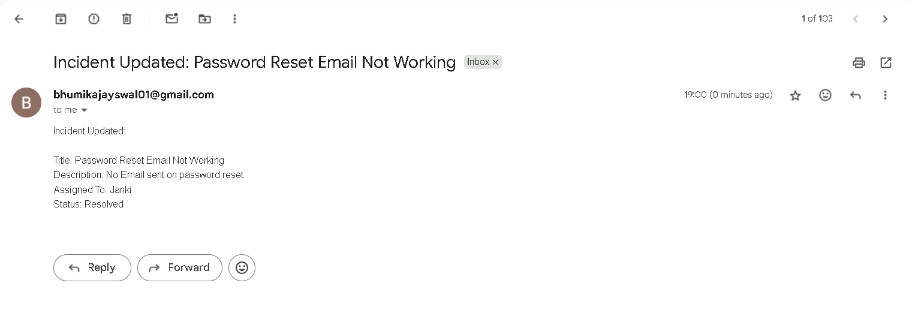

## 🚨 Incident Management System

An open-source web app to **report**, **track**, and **resolve** incidents in infrastructure or applications.

---

## 🛠 Tech Stack

- **Backend:** Python (Flask)
- **Database:** SQLite
- **UI:** HTML + Bootstrap
- **Email:** Gmail SMTP (Flask-Mail)
- **Containerization:** Docker
- **Deployment:** Gunicorn (Production) with Docker
- **Version Control:** Git & GitHub

---

## ✅ Features

- 📝 Report new incidents
- 📋 View all logged incidents
- ✏️ Update status and assign a responsible person
- 📧 Email notifications on new incident submission
- 🐳 Dockerized deployment for local and production use

---

## 📁 Project Structure

<pre>
incident-management/
├── app/
│   ├── __init__.py
│   ├── models.py
│   ├── routes.py
│   ├── templates/
│      ├── incidents.html
│      ├── report.html
│      └── edit.html
│   
├── screenshots/
│   ├── 01_homepage.png
│   ├── 02_report_form.png
│   ├── 03_email_received.png
│   └── 04_update_mail.png
|
|── static/
│
├── instance/
│   └── database.db
│
├── .env
├── .gitignore
├── .dockerignore
├── Dockerfile
├── docker-compose.yml
├── config.py
├── requirements.txt
├── run.py
├── start_app.bat
└── README.md
</pre>

---

## 🚀 Run Project with Docker (Recommended)

```bash```

docker-compose build

docker-compose up -d

Then visit: http://localhost:5000

##🧪 Run Project Manually (Without Docker)
✅ Open PowerShell or Git Bash

🔁 Navigate to project root directory:

    cd path/to/incident-management

📦 Create and activate virtual environment:

    python -m venv venv
    venv\Scripts\activate  # On Windows

📚 Install dependencies:

    pip install -r requirements.txt

⚙️ Create .env file and add your config:

    MAIL_USERNAME=your_email@gmail.com
    MAIL_PASSWORD=your_password
    SQLALCHEMY_DATABASE_URI=sqlite:///instance/database.db

🛠 Create database:

    flask shell
    >>> from app import db
    >>> db.create_all()
    >>> exit()

🚀 Run the app:

    flask run

Then open: http://127.0.0.1:5000

##⚡ Run App Instantly using .bat file (Windows)
A pre-written .bat file is available for convenience.

📄 start_app.bat

    @echo off
    cd /d "%~dp0"
    call venv\Scripts\activate
    flask run

✅ How to use:

    1.Double-click on start_app.bat

    2.Your virtual environment will activate and start the Flask app

    3.Open http://127.0.0.1:5000

## 📧 Email Notification Example

### New Incident Notification

| Homepage                                 | Report Form                               | Email Notification                          |
| ---------------------------------------- | ----------------------------------------- | ------------------------------------------- |
|  |  |  |

---

### Incident Update Notification

📤 When the incident is updated, a second email like this is sent:

| Incident Updated Email |
| ---------------------- |
|  |
