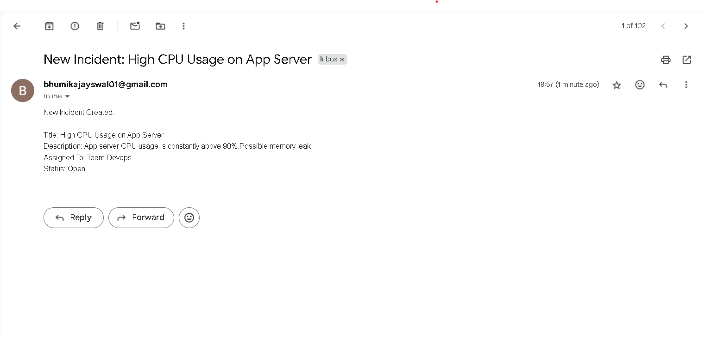

# 🚨 Incident Management System

An open-source web app to **report**, **track**, and **resolve** incidents in infrastructure or applications.

---

## 🛠 Tech Stack

- **Backend:** Python (Flask)
- **Database:** SQLite
- **UI:** HTML + Bootstrap
- **Email:** Gmail SMTP (Flask-Mail)
- **Containerization:** Docker
- **Version Control:** Git & GitHub

---

## ✅ Features

- Report new incidents
- View all logged incidents
- Edit status and assign responsible person
- Send email notification when a new issue is reported
- Deployed using Docker with Gunicorn in production mode

---

### 📁 Project Structure

<pre> ```bash incident-management/ ├── app/ │ ├── __init__.py │ ├── models.py │ ├── routes.py │ └── templates/ │ ├── incidents.html │ ├── report.html │ └── edit.html │ ├── static/ ├── screenshots/ │ ├── 01_homepage.png │ ├── 02_report_form.png │ └── 03_email_received.png │ ├── .env ├── .gitignore ├── .dockerignore ├── Dockerfile ├── docker-compose.yml ├── config.py ├── run.py ├── requirements.txt └── README.md ``` </pre>

## 🚀 Running Locally with Docker

```bash```
docker-compose build
docker-compose up -d

Then open: http://localhost:5000

📧 Email Notification Example
When a new incident is submitted, an email like this is sent:

Subject: New Incident Reported

Title: Server Down
Description: The database server is not responding since 11:00 AM.

| Homepage                                 | Report Form                               | Email Notification                          |
| ---------------------------------------- | ----------------------------------------- | ------------------------------------------- |
|  |  |  |


